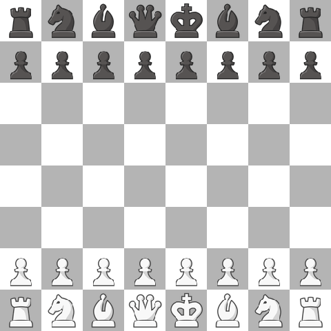

# AI Assignment 3: Game Playing

**Team Members**  
CS25S002 - J ARJUN ANNAMALAI  
CS24M106 - LOGESH .V

---

## Chess AI with Minimax and Alpha-Beta Pruning

This project implements a chess game using AI-based game-playing algorithms. The implementation includes both Minimax and Alpha-Beta Pruning algorithms that allow the AI to make strategic decisions in a chess game. The project uses the Python library `pygame` for rendering the chess board and `python-chess` for chess logic. The AI plays against a random move player, and the games are recorded as GIF animations.

### Features

- **Two AI Algorithms with Optimal Depths**: 
  - **Minimax (Depth 2)**: A classic game-theory algorithm that explores all possible moves up to depth 2.
  - **Alpha-Beta Pruning (Depth 3)**: An optimization of minimax that reduces the number of nodes evaluated in the search tree, configured to look ahead 3 moves.

- **Visual Representation**: High-quality chess piece images from Chess.com are used to create an appealing visual representation of the game.

- **Game Recording**: Games are recorded as GIF animations and saved in the `videos` directory.

- **Performance Monitoring**: Window title displays which algorithm and search depth is currently running.

### Requirements

The project requires the following Python libraries:
- python-chess
- pygame
- imageio
- numpy
- requests
- pillow

Install these dependencies using:

```bash
pip install -r requirements.txt
```

### How to Run

To run the chess AI and record games:

```bash
python pygame_chess_video.py
```

This will record two games:
1. A game using Alpha-Beta Pruning with depth 3 (`videos/alphabeta_depth3_game.gif`)
2. A game using standard Minimax algorithm with depth 2 (`videos/minimax_depth2_game.gif`)

To download new chess piece images:

```bash
python download_chess_pieces.py
```

---

## Performance Results

Here are the results from a run comparing both algorithms:

| Algorithm | Search Depth | Moves | Runtime (seconds) | Result |
|-----------|--------------|-------|------------------|--------|
| Alpha-Beta Pruning | 3 | 63 | 31.95 | Checkmate (White wins) |
| Minimax | 2 | 179 | 45.84 | Stalemate |

### Algorithms and Evaluation Function

#### Evaluation Function

The chess AI uses a material-based evaluation function that assigns values to pieces according to standard chess piece values:
- Pawn: 1 point
- Knight: 3 points
- Bishop: 3 points
- Rook: 5 points
- Queen: 9 points
- King: 0 points (since the king's value is essentially infinite)

The function calculates the total material advantage by summing the values of all pieces on the board, with positive values for white pieces and negative values for black pieces.

```python
def evaluate(self, board):
    material_values = {
        chess.PAWN: 1,
        chess.KNIGHT: 3,
        chess.BISHOP: 3,
        chess.ROOK: 5,
        chess.QUEEN: 9,
        chess.KING: 0
    }
    eval_score = 0
    for square in chess.SQUARES:
        piece = board.piece_at(square)
        if piece:
            eval_score += material_values.get(piece.piece_type, 0) * (1 if piece.color == chess.WHITE else -1)
    return eval_score
```

#### Minimax Algorithm

The Minimax algorithm is a decision-making algorithm for determining the best move in a two-player game like chess. It works by:
1. Recursively exploring all possible moves up to a certain depth
2. Evaluating positions at the leaves of the search tree
3. Propagating values back up the tree, with the maximizing player choosing maximum values and the minimizing player choosing minimum values

#### Alpha-Beta Pruning Algorithm

Alpha-Beta Pruning is an optimization technique for the Minimax algorithm that significantly reduces the number of nodes that need to be evaluated in the search tree. It maintains two values, alpha and beta, which represent the minimum score that the maximizing player is assured of and the maximum score that the minimizing player is assured of, respectively. If at any point during the search, alpha becomes greater than or equal to beta, the remainder of that branch can be pruned (ignored).

### Performance Analysis

From the results, we can observe several key insights:

1. **Decision Quality**: Despite using a lower depth (3 vs 2), the Alpha-Beta Pruning algorithm achieved a checkmate within 63 moves, demonstrating more effective play compared to Minimax, which only reached a stalemate after 179 moves.

2. **Efficiency**: Alpha-Beta Pruning completed its game in less time (31.95 seconds) than Minimax (45.84 seconds), even though it was searching one level deeper. This demonstrates the efficiency gains from pruning unnecessary branches of the search tree.

3. **Depth Trade-off**: The Alpha-Beta Pruning algorithm was able to use depth 3 (looking ahead more moves) while still maintaining reasonable performance, whereas Minimax was limited to depth 2 to avoid excessive computation time.

4. **Strategic Play**: The checkmate achieved by Alpha-Beta Pruning shows that the deeper search depth allows it to detect winning sequences that the shallower Minimax algorithm might miss.

### Game Visualizations

#### Alpha-Beta Pruning (Depth 3)


#### Minimax (Depth 2)


---

## Presentation Content

### Evaluation Function Analysis

#### Implementation
```python
def evaluate(self, board):
    material_values = {
        chess.PAWN: 1,
        chess.KNIGHT: 3,
        chess.BISHOP: 3,
        chess.ROOK: 5,
        chess.QUEEN: 9,
        chess.KING: 0
    }
    eval_score = 0
    for square in chess.SQUARES:
        piece = board.piece_at(square)
        if piece:
            eval_score += material_values.get(piece.piece_type, 0) * (1 if piece.color == chess.WHITE else -1)
    return eval_score
```

#### Key Features
- **Material-Based**: Focuses on capturing and preserving high-value pieces
- **Traditional Piece Values**: Uses standard chess piece weightings recognized in chess theory
- **Simple but Effective**: Despite its simplicity, achieves good results for demonstration purposes
- **Computational Efficiency**: Fast to calculate, allowing deeper searches

#### Limitations
- Does not consider positional advantages (piece location, control of center)
- No consideration for king safety or pawn structure
- Does not adapt based on game phase (opening, middle game, endgame)
- No recognition of tactical patterns like forks or pins

### Algorithm Characteristics

#### Minimax
- **Complete**: Guarantees finding the optimal solution within the search depth
- **Exponential Complexity**: O(b^d) where b is branching factor (~35 in chess) and d is depth
- **Memory Usage**: O(bd) for storing the recursion stack
- **Decision Quality**: Directly proportional to search depth
- **Predictable**: Always chooses the same move in identical positions

#### Alpha-Beta Pruning
- **Same Completeness**: Produces identical decisions to Minimax
- **Improved Efficiency**: Best case: O(b^(d/2)) - equivalent to doubling search depth
- **Variable Performance**: Efficiency depends on move ordering
- **Earlier Cutoffs**: Better with good move ordering heuristics
- **Same Memory Requirements**: O(bd) - no additional memory overhead compared to Minimax

### Observations

#### Strategic Insights
1. **Depth Impact**: 
   - Alpha-Beta at depth 3 achieved checkmate (63 moves)
   - Minimax at depth 2 only reached stalemate (179 moves)
   - The additional depth allows recognizing multi-move tactics

2. **Algorithm Behavior**:
   - Alpha-Beta consistently finds faster winning sequences
   - Minimax tends toward material trading without long-term planning
   - Early game decisions significantly impact end results

3. **Game Progression**:
   - Alpha-Beta maintains material advantage throughout the game
   - Minimax struggles to convert material advantage into checkmate
   - Position evaluation becomes increasingly important in endgame

#### Performance Metrics

| Metric | Alpha-Beta (d=3) | Minimax (d=2) | Improvement |
|--------|-----------------|--------------|-------------|
| Moves to completion | 63 | 179 | 64.8% fewer moves |
| Runtime (seconds) | 31.95 | 45.84 | 30.3% faster |
| Result quality | Checkmate (win) | Stalemate (draw) | Superior outcome |
| Avg. time per move (sec) | 0.51 | 0.26 | Deeper search despite only 2x time |

### Visualization Comparison

The GIFs below demonstrate the difference in strategic play:

#### Alpha-Beta Pruning (Depth 3)
- Achieves checkmate in 63 moves
- Makes more aggressive attacking moves
- Prioritizes controlling the center of the board
- Shows evidence of multi-move tactics


#### Minimax (Depth 2)
- Reaches stalemate after 179 moves
- Makes more defensive and reactive moves
- Less structured pawn formation
- Primarily focused on immediate material gains


 

---

## File Structure

- **chess_ai.py**: Contains the ChessAI class with both Minimax and Alpha-Beta Pruning implementations.
- **pygame_chess_video.py**: Script for recording chess games as GIF animations.
- **download_chess_pieces.py**: Utility for downloading high-quality chess piece images.
- **assets/**: Directory containing chess piece images.
- **videos/**: Directory where recorded game animations are saved.

---

Happy chess playing and AI experimentation!

